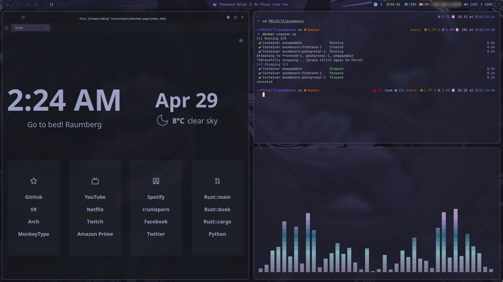
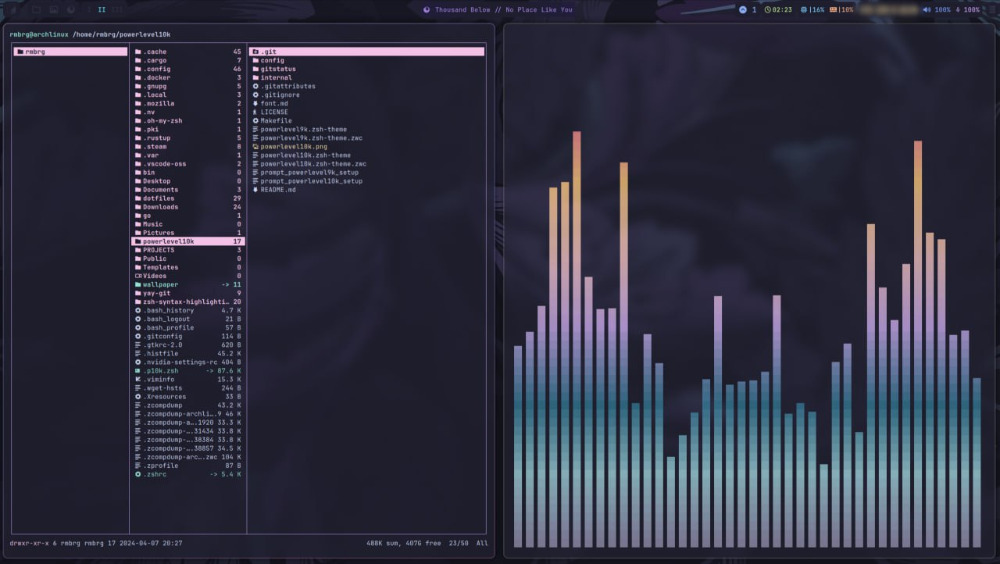
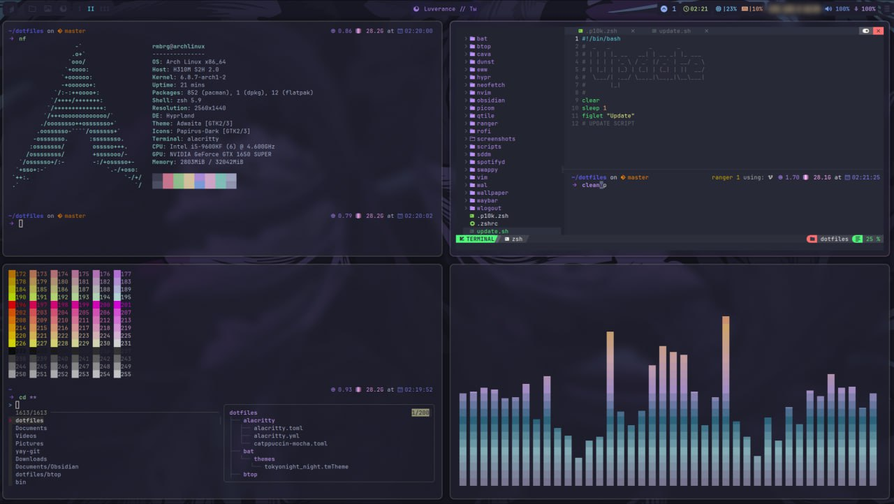
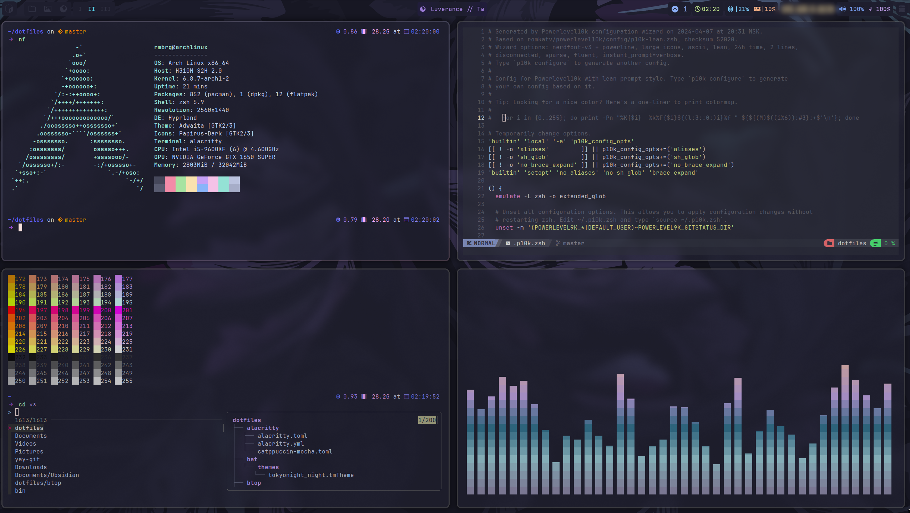
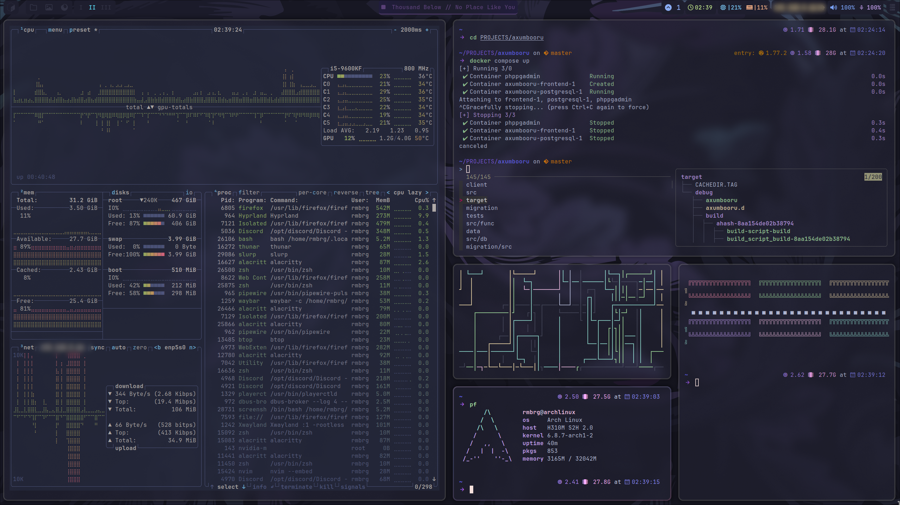

<h1 align="center"> Nocturne .files  </h1>

<!-- BADGES -->
</br>

<p align="center">
  
  </br>
  
  
  </br>
</p>

<!-- INFORMATION -->
<h1 align="left"> :blue_book: About</h1> 

</br>

 - OS: [**`Arch Linux`**](https://archlinux.org/)
 - WM: [**`Hyprland`**](https://github.com/hyprwm/Hyprland)
 - Bar: [**`Waybar`**](https://github.com/Alexays/Waybar)
 - Terminal: [**`Alacritty`**](https://github.com/alacritty/alacritty)
 - App Launcher: [**`Rofi`**](https://github.com/davatorium/rofi)
 - Notify Daemon: [**`Dunst`**](https://github.com/dunst-project/dunst)
 - Shell: [**`(oh my) Zsh`**](https://github.com/zsh-users/zsh)

</br>

<!-- IMAGES -->
## 🖼️ Gallery







<!-- FEATURES -->
## 🚀 Features
* Fully built system with modern minimalistic styling
* Support for custom implementations thanks to the smart organization of source files 
* VIM-based system configuration of shortcuts (you can get rid of the mouse!) / shortcuts listed below
* Custom configuration of Firefox
* Awesome waybar configuration with color gradient and animations

<table align="center">
   <tr>
      <th align="center">
         <sup>:warning: WARNING :warning:</sup>
      </th>
   </tr>
   <tr>
      <td align="center">
        CURRENT CONFIGURATION IS DESIGNED FOR THREE-MONITOR SYSTEM OF THE AUTHOR.
        PLEASE, CONSIDER TUNING HYPR/MONITORS VARIABLES IN ORDER TO RUN THE SCREEN.
        IF YOU FIND ERRORS IN THE SHELL OR CONFIGURATION OPTIONS,
        PLEASE REPORT THE PROBLEM IN THE ISSUES SECTION.
   </tr>
   </table>


<!-- INSTALLATION -->
## :blue_book: Installation
- All necessary scripts are provided in repo!  
```bash
# Makefile utilizes install and deploy scripts, all the necessary info is in MANIFEST and PACKAGES
make all && make clean
# Or do it manually:
chmod +x deploy.sh install.sh
./install.sh
./deploy.sh 
```
- Neovim is not the part of the .files! 
- It is recommended to install [NvChad](https://github.com/NvChad/NvChad) because of its perfect compatibility.
- To use .zsh theme you also need to install [p10k.zsh](https://github.com/romkatv/powerlevel10k)

<!-- HOTKEYS -->
## 💻 Hotkeys
* **VIM-based navigation** - `super + h`, `super + j`, `super + k`, `super + l` :: left/down/up/right windows
* **Open the terminal** - `super + w`
* **Open Ranger** - `super + e`
* **Open browser** - `super + b`
* **Switch workspace** - `super + 1..9`
* **Move the window to another desktop** - `super + shift + 1/6`
* **Switch to the previous/next workspace** - `super + ctrl + h` / `super + ctrl + l`
* **Kill active window** - `super + q`
* **Toggle window floating** - `super + t`
* **Toggle window split** - `super + s`
* **Resize window with mouse** - `super + rmb`
* **Resize window with keyboard** - `super + shift + h/j/k/l`
* **Toggle fullscreen of active window** - `super + f`
* **Take a screenshot** - `super + printscreen`
* **Cliphistory** - `super + v`
* **Keybindings** - `super + i`

See more hotkeys in `$HOME/.config/hypr/conf/`


<!-- Autor -->
## Author
**You can contact me with:**
- [GitHub](https://github.com/Raumberg/)
- Discord: raumberg
- **Lets contribute to UNIX community together!**
